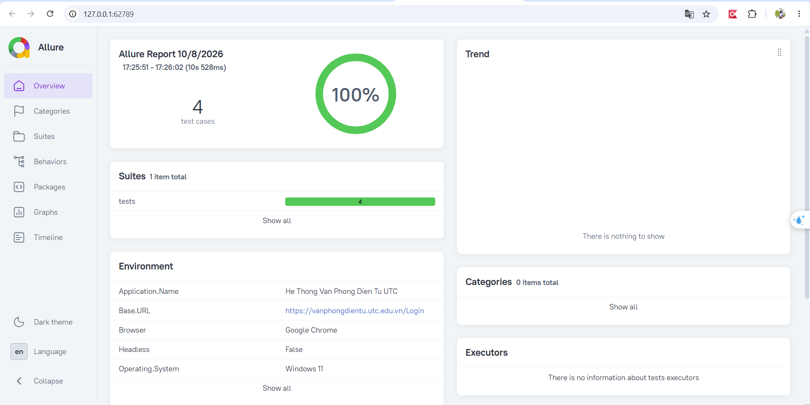

# Automation Test Hệ Thống Văn Phòng Điện Tử UTC

Dự án kiểm thử tự động (Automation Testing) toàn diện cho phân hệ Đăng nhập của **Hệ thống Văn phòng điện tử - Trường Đại học Giao thông Vận tải**.
- **URL kiểm thử:** [https://vanphongdientu.utc.edu.vn/Login](https://vanphongdientu.utc.edu.vn/Login)
- **Mô hình kiến trúc:** Page Object Model (POM) kết hợp BasePage & BaseTest chuẩn công nghiệp
- **Công nghệ sử dụng:** Python 3, Selenium WebDriver, OpenPyXL, Pytest, Allure Report.
- **Tài liệu kịch bản & Báo cáo:** [TestCases_VanPhongDienTu_UTC.xlsx](TestCases_VanPhongDienTu_UTC.xlsx)
- **Báo cáo trực quan tương tác:** **Allure Report** (tự động phân loại lỗi, đính kèm screenshot, thông tin môi trường và từng bước thực thi).

---

## 1. Cấu trúc thư mục dự án chuẩn hóa

```text
AutomationTest/
├── base/
│   ├── __init__.py
│   └── base_test.py                    # Lớp cha BaseTest kế thừa unittest.TestCase (quản lý WebDriver)
├── pages/
│   ├── __init__.py
│   ├── base_page.py                    # Lớp cha BasePage đóng gói thao tác Selenium & tự đính kèm ảnh vào Allure
│   └── login_page.py                   # Lớp LoginPage kế thừa BasePage (chứa locators & nghiệp vụ Login UTC)
├── tests/
│   ├── __init__.py
│   └── test_login.py                   # Bộ 20 Test Cases tích hợp Allure (Epic, Feature, Story, Severity, Steps)
├── screenshots/                        # Thư mục lưu 20 ảnh chụp màn hình minh chứng
│   ├── TC01_empty_username.png
│   ├── ...
│   └── TC20_footer_links.png
├── allure-results/                     # Dữ liệu JSON thô kết quả do Allure thu thập khi chạy test
├── allure-report/                      # Báo cáo HTML tĩnh hoàn chỉnh của Allure Report
├── conftest.py                         # Pytest fixture/hooks: cấu hình môi trường, phân loại lỗi & chụp ảnh khi fail
├── config.py                           # Cấu hình URL, thời gian chờ, tài khoản kiểm thử
├── requirements.txt                    # Danh sách thư viện cần thiết (Selenium, Pytest, Allure-pytest, OpenPyXL)
├── run_tests.py                        # Script thực thi kiểm thử và tự cập nhật kết quả vào Excel
├── run_allure.py                       # Script chuyên dụng chạy Pytest + Allure và tự mở báo cáo trên trình duyệt
├── run_allure.bat                      # Phím tắt click đúp trên Windows để chạy test và mở Allure Report
├── open_allure_report.bat              # Phím tắt click đúp trên Windows để mở lại Allure Report bất cứ lúc nào
└── TestCases_VanPhongDienTu_UTC.xlsx   # File Excel kịch bản & báo cáo tổng quan kiểm thử
```

---

## 2. Chi tiết phân chia trách nhiệm các lớp (OOP & POM)

- **`pages/base_page.py` (`BasePage`)**:
  - Đóng gói các hàm tiện ích Selenium WebDriver: `open_url()`, `find_element()`, `enter_text()`, `click()`, `get_text()`, `get_attribute()`, `execute_script()`.
  - Tích hợp tự động đính kèm ảnh chụp màn hình `allure.attach.file()` vào báo cáo Allure khi gọi `capture_screenshot()`.
- **`pages/login_page.py` (`LoginPage`)**:
  - Kế thừa `BasePage`.
  - Khai báo Locators trang Đăng nhập UTC và các hàm nghiệp vụ riêng của trang: `enter_username()`, `enter_password()`, `set_remember_me()`, `click_login()`, `get_error_message()`, `is_password_masked()`, `navigate_with_tab_key()`, v.v.
- **`base/base_test.py` (`BaseTest`)**:
  - Kế thừa `unittest.TestCase`.
  - Quản lý vòng đời khởi tạo và dọn dẹp trình duyệt: `setUpClass()` mở Chrome, `tearDownClass()` đóng Chrome, `setUp()` khởi tạo `self.login_page = LoginPage(self.driver)` và mở trang trước mỗi test.
- **`tests/test_login.py` (`TestLogin`)**:
  - Kế thừa `BaseTest`.
  - Triển khai 20 Test Cases từ `test_tc01` đến `test_tc20`.
  - Gắn đầy đủ siêu dữ liệu Allure Report: `@allure.epic`, `@allure.feature`, `@allure.story`, `@allure.severity`, `@allure.title`, `@allure.description` cùng từng bước thực hiện `with allure.step(...)`.
- **`conftest.py`**:
  - Tự động sinh `environment.properties` (thông tin OS, Trình duyệt, Python, Selenium, Pytest, URL hệ thống).
  - Tự động sinh cấu hình phân loại lỗi `categories.json` (Product Defects, Infrastructure/Test Defects).
  - Tự động bắt sự kiện thất bại của test case để chụp ảnh màn hình lỗi.

---

## 3. Bảng ma trận 20 Test Cases bao quát toàn diện Login

| STT | Mã TC | Phân nhóm kiểm thử | Tên kịch bản kiểm thử | Mức độ nghiêm trọng (Allure Severity) | Kết quả mong đợi |
|:---:|:---:|:---|:---|:---:|:---|
| 1 | **TC01** | Negative | Để trống Tên đăng nhập (chỉ nhập Mật khẩu) | CRITICAL | Báo lỗi: *"Bạn chưa nhập tên đăng nhập"* |
| 2 | **TC02** | Negative | Để trống Mật khẩu (chỉ nhập Tên đăng nhập) | CRITICAL | Báo lỗi: *"Bạn chưa nhập mật khẩu"* |
| 3 | **TC03** | Negative | Đúng định dạng User, sai Mật khẩu | CRITICAL | Báo lỗi: *"Tài khoản hoặc mật khẩu không đúng."* |
| 4 | **TC04** | Negative | Sai Tên đăng nhập, đúng định dạng Mật khẩu | NORMAL | Báo lỗi: *"Tài khoản hoặc mật khẩu không đúng."* |
| 5 | **TC05** | Positive | Đăng nhập có chọn "Giữ tôi luôn đăng nhập" | BLOCKER | Đăng nhập thành công vào trang chủ |
| 6 | **TC06** | Positive | Đăng nhập không chọn "Giữ tôi luôn đăng nhập" | BLOCKER | Đăng nhập thành công vào trang chủ |
| 7 | **TC07** | Negative | Để trống cả Tên đăng nhập và Mật khẩu | NORMAL | Báo lỗi: *"Bạn chưa nhập tên đăng nhập"* |
| 8 | **TC08** | UI & Security | Kiểm tra tính năng ẩn mật khẩu (Masked) | NORMAL | Thuộc tính `type='password'`, ký tự dạng `•` / `*` |
| 9 | **TC09** | Liên kết SSO | Kiểm tra liên kết "Đăng nhập bằng e-mail UTC" | CRITICAL | Trỏ tới SSO Google OAuth UTC (`accounts.google.com`) |
| 10 | **TC10** | Liên kết chức năng | Kiểm tra liên kết "Bạn quên mật khẩu đăng nhập ?" | NORMAL | Chuyển hướng tới `/Login/GetPass` (*Lấy lại mật khẩu*) |
| 11 | **TC11** | Bàn phím | Đăng nhập bằng cách nhấn phím Enter từ bàn phím | NORMAL | Gửi form thành công và kiểm tra validate đầu vào |
| 12 | **TC12** | Khoảng trắng | Tên đăng nhập chỉ chứa toàn khoảng trắng | NORMAL | Hệ thống từ chối khoảng trắng và báo lỗi |
| 13 | **TC13** | Khoảng trắng | Mật khẩu chỉ chứa toàn khoảng trắng | NORMAL | Hệ thống từ chối khoảng trắng và báo lỗi |
| 14 | **TC14** | Bảo mật SQLi | Kiểm tra chống tấn công SQL Injection cơ bản | CRITICAL | Hệ thống an toàn (không crash/lỗi 500), từ chối an toàn |
| 15 | **TC15** | Bảo mật XSS | Kiểm tra chống tấn công XSS Script Injection | CRITICAL | Không thực thi script, xử lý chuỗi an toàn |
| 16 | **TC16** | Giá trị biên | Tên đăng nhập độ dài cực đại (300 ký tự) | NORMAL | Hệ thống không tràn bộ nhớ/vỡ layout, báo lỗi an toàn |
| 17 | **TC17** | Ký tự đặc biệt | Tên đăng nhập chứa ký tự đặc biệt | NORMAL | Xử lý an toàn và từ chối tài khoản không tồn tại |
| 18 | **TC18** | Giao diện UI | Kiểm tra văn bản gợi ý mờ (Placeholder) | MINOR | Hiển thị đúng: *"Tên đăng nhập"* & *"Mật khẩu"* |
| 19 | **TC19** | Phím Tab | Kiểm tra điều hướng con trỏ bằng phím `Tab` | MINOR | Con trỏ nhảy chính xác sang ô Mật khẩu (`userpwd`) |
| 20 | **TC20** | Liên kết Footer | Kiểm tra tính đúng đắn của liên kết chân trang | MINOR | Link "Trung tâm trợ giúp" và mailto "Ý kiến phản hồi" |

*Lưu ý về TC05 & TC06:* Nếu dùng tài khoản mẫu `huongnt`/`123456@utc`, web trường sẽ báo sai tài khoản (đúng với thực tế do CSDL trường không có tài khoản này). Bạn có thể cấu hình tài khoản thật trong `config.py` để test thành công.

---

## 4. Hướng dẫn chạy kiểm thử & Xem báo cáo

### Cách 1: Xuất báo cáo Allure Report (Khuyên dùng)

#### Lựa chọn 1.1: Sử dụng file chạy nhanh (1-click)
- Click đúp vào file **`run_allure.bat`**: Tự động chạy toàn bộ bộ test và bật trình duyệt hiển thị Allure Report.
- Hoặc click đúp vào file **`open_allure_report.bat`**: Mở lại báo cáo Allure đã tạo bất kỳ lúc nào mà không cần chạy lại test.

#### Lựa chọn 1.2: Sử dụng dòng lệnh `run_allure.py`
```powershell
# Chạy toàn bộ test, biên dịch và tự động mở Allure Report trên trình duyệt:
python run_allure.py

# Chạy ngầm (Headless) và tạo báo cáo:
python run_allure.py --headless

# Chạy một test case cụ thể (ví dụ TC01):
python run_allure.py -k test_tc01

# Khởi động máy chủ Allure Server trực tiếp (allure serve):
python run_allure.py --serve
```

#### Lựa chọn 1.3: Chạy thủ công với Pytest và Allure CLI
```powershell
# Bước 1: Chạy Pytest và gom dữ liệu vào thư mục allure-results
pytest tests/test_login.py --alluredir=allure-results -v

# Bước 2: Tạo và xem báo cáo ngay trên trình duyệt:
allure serve allure-results

# Hoặc biên dịch ra thư mục HTML tĩnh allure-report:
allure generate allure-results -o allure-report --clean
allure open allure-report
```

---

### Cách 2: Chạy bằng `run_tests.py` (Cập nhật file Excel)
Tự động chạy, in tiến độ tiếng Việt trực quan, chụp ảnh màn hình và cập nhật kết quả vào file Excel `TestCases_VanPhongDienTu_UTC.xlsx`:
```powershell
# Chạy trực quan có trình duyệt Chrome mở lên:
python run_tests.py

# Chạy chế độ ngầm (Headless):
python run_tests.py --headless

# Chuyển hướng sang chạy Allure Report từ run_tests.py:
python run_tests.py --allure
```

---

## 5. Các tính năng nổi bật của Allure Report trong dự án

1. **Dashboard Tổng quan (Overview):**
   - Biểu đồ tròn trực quan hiển thị tỉ lệ Pass / Fail / Broken / Skipped.
   - Thống kê thời lượng thực thi của từng test case.
2. **Environment Widget:**
   - Hiển thị tự động thông số hệ thống: Hệ điều hành (Windows), Trình duyệt (Chrome), Phiên bản Python, Selenium, Pytest, URL kiểm thử.
3. **Phân nhóm theo nghiệp vụ (Behaviors):**
   - **Epic:** *Hệ Thống Văn Phòng Điện Tử UTC*
   - **Feature:** *Phân hệ Đăng nhập (Authentication)*
   - **Story:** Chia rõ ràng thành các câu chuyện người dùng: *Validation*, *Authentication*, *UI & Security*, *SSO*, *Navigation*, *UX & Shortcuts*.
4. **Chi tiết từng bước kiểm thử (Steps):**
   - Từng thao tác nhập liệu, nhấn nút, kiểm tra thông báo lỗi đều được bóc tách theo step tiếng Việt rõ ràng.
5. **Đính kèm minh chứng (Attachments):**
   - Ảnh chụp màn hình tại từng test case được nhúng trực tiếp vào từng bước kiểm thử trong giao diện Allure.
   - Tự động bắt ảnh chụp màn hình khi xảy ra lỗi (Failure Hook).

